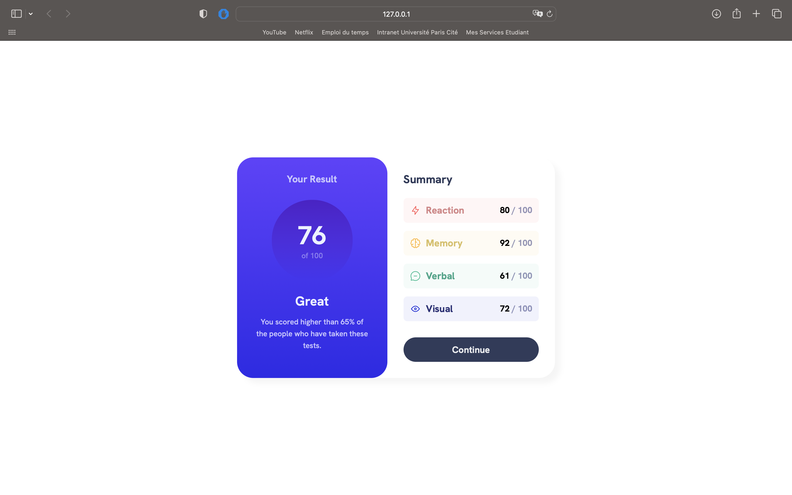

# Frontend Mentor - Result summary component

This is a solution to the [Results summary component on Frontend Mentor](https://www.frontendmentor.io/challenges/results-summary-component-CE_K6s0maV). Frontend Mentor challenges help you improve your coding skills by building realistic projects. 

## Table of contents

- [Overview](#overview)
  - [The challenge](#the-challenge)
  - [Screenshot](#screenshot)
  - [Links](#links)
- [My process](#my-process)
  - [Built with](#built-with)
  - [What I learned](#what-i-learned)
  - [Continued development](#continued-development)
  - [Useful resources](#useful-resources)
- [Author](#author)

## Overview

### The challenge

Users should be able to:

- View the optimal layout depending on their device's screen size
- See hover and focus states for interactive elements

### Screenshot



### Links

- Live Site URL: https://remarkable-naiad-51550e.netlify.app

## My process

### Built with

- Semantic HTML5 markup
- CSS custom properties
- Flexbox

### What I learned

I learned how to use media queries to make an full responsive website for mobile and desktop.
I also learned how to use linear-gradiant and how can i install a font in a website.

```css
@media only screen and (max-width: 480px) {

    #baseContener{
        display: flex;
        flex-direction: column;
    }
}

@font-face {
    font-family: 'HankenGrotesk';
    font-weight: bolder;
    src: url('/assets/fonts/static/HankenGrotesk-ExtraBold.ttf');
}

#resultContainer{
    background: linear-gradient(0deg, hsl(241, 81%, 54%) 0%, hsl(250, 100%, 63%) 100%);
    border-radius: 30px;
}
```

### Continued development

I want to learn more about responsive content and how to use gridbox. I know flexbox is good but i want to learn more about gridbox and also how to use correctly media queries.

### Useful resources

- [Pierre Giraud](https://www.pierre-giraud.com/html-css-apprendre-coder-cours/) - The website is in french but it's with that than i learned how to code in HTML and CSS.

## Author

- Github - [Isekku](https://github.com/Isekku)
- Frontend Mentor - [@Isekku](https://www.frontendmentor.io/profile/Isekku)
- Twitter - [@kesusama](https://www.twitter.com/kesusama)
